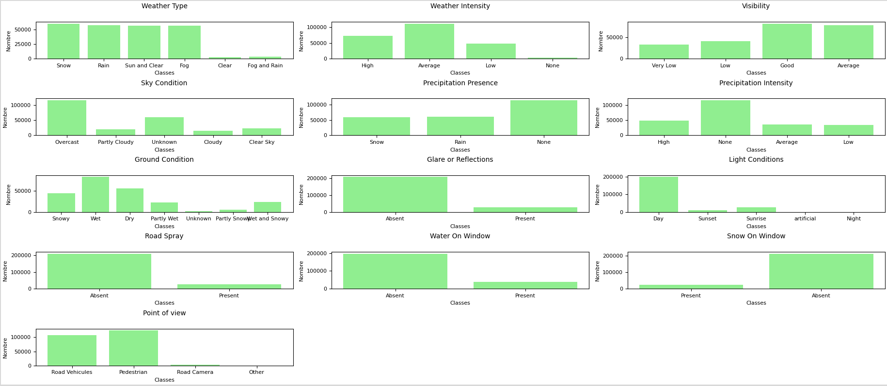

# Enhanced Style-Based Neural Architectures for Real-Time Weather Classification

## 📌 Overview

This project explores **style-based neural architectures** for real-time **weather classification** using advanced deep learning techniques. Our models integrate **PatchGAN, Gram Matrices, and Attention Mechanisms** to efficiently extract weather-related features from images.

## 💡 Idea behind our article


https://github.com/user-attachments/assets/1ddeb22f-9a77-400d-86e5-d87c97c9e727

Find a better quality video here: https://youtu.be/JHXpfte628s


 
## 🎥 Real-time demonstration


https://github.com/user-attachments/assets/622c3aaf-647b-423b-a1ca-0ce9f93d46ae


Find a better quality video here: https://youtu.be/hWglszOLNpg?si=zYHB_EMw8qjKdjgh


## 🚀 Package Installation

Before running the model, ensure you have **Python 3.8.19** installed. You can create a virtual environment and install the necessary dependencies with:

```bash
pip install -r requirements.txt
```
See the "readme_installation_on_window.txt" file for installation on Windows operating system

## 🎯 Quick Test: PatchGAN-MultiTasks (PM) Model

Our **PatchGAN-MultiTasks (PM)** model, with only **3,188,736 parameters**, is optimized for real-time execution. We will soon publish the **dataset** along with **detailed explanations** on how to perform various tests, including:

- **Grad-CAM** & **T-SNE** visualizations 🖼️
- **Modularity tests** by selectively removing tasks 🔍
- Performance validation against our published results 📊

### ✅ Real-Time Inference with a Camera

To test the model in real time using your **camera**, execute the following command:

```bash
python test__PatchGAN_MultiTasks.py --data datas/test.json \
    --build_classifier classes_files.json \
    --config_path Model_weight/best_hyperparams_fold_0.json \
    --model_path Model_weight/best_model_fold_0.pth \
    --mode camera
```

### ⚠️ Important Notes
- Specify the **hyperparameter configuration file** using `--config_path` to correctly reconstruct the model architecture.
- Use `--build_classifier` to define the **tasks and class mappings**.

---

Stay tuned for updates! 📢 We will be releasing more resources and datasets soon.
## Distribution of the dataset

## Benchmark validation

To test the benchmarks, use the --mode benchmark option and specify the mapping file between your classes and those of the benchmark.

```bash
python test__PatchGAN_MultiTasks.py --build_classifier datas/classes_files.json \ 
    --benchmark_mapping Test_benchmark/classes_correspondance_benchmark.json  \
    --config_path Model_weight/PatchGAN_MultiTasks/best_model_fold_0_hyperparameters.json \ 
    --model_path Model_weight/PatchGAN_MultiTasks/best_model_fold_0.pth \
    --mode benchmark \
    --benchmark_folder benchmark_dataset \ 
    --save_dir results_test

```

